
<h1 align="center">基于框架的智能停车系统+vue</h1>

## 简介
智能停车系统：角色分为管理员、用户；包括功能模块：用户管理、车位信息管理、停车信息管理、会员制度管理和会员办理管理等，多种会员与停车信息操作界面，简化管理，提高效率。    --计算机毕业设计源码；毕设源码；java毕业设计源码

## 联系方式

<h3 align="center">获取完整代码与数据库文件 + 微信：deepguan QQ: 86050149 QQ群: 783742310</h3>

<h3 align="center">可帮忙远程部署 包运行成功！提供远程部署、修改代码、设计文档指导、代码讲解等服务！</h3>

## 功能介绍（完整见运行截图）
管理员： 基本功能包括用户注册、登录、以及退出系统。可通过用户管理、车辆管理、停车位管理和会员管理模块进行各类信息的添加、编辑和删除。支持上传车位图片、附加说明，并提供错误提示信息指导。通过导航菜单快速切换功能模块，查看用户详细信息和审核会员状态。拥有完善的会员和停车信息管理页面，简化停车位和会员数据的高效管理与维护。

用户： 提供登录注册入口，并拥有个人中心以查看和修改个人资料。在停车信息管理模块中，用户可录入或更新停车位及车辆信息，查看停车时长和费用数据。同时可以在会员管理模块中输入会员信息，选择会员类型，查询及管理会员状态。通过导航栏进入各管理模块，享受查询、管理和查看停车及会员详细数据的便捷服务，实现智能化停车体验。

## 运行截图
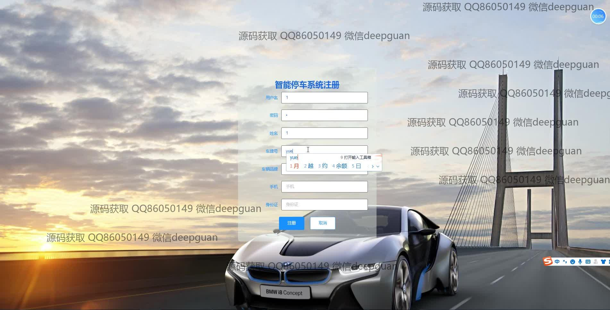

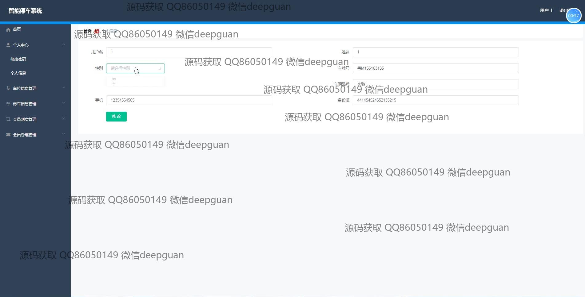
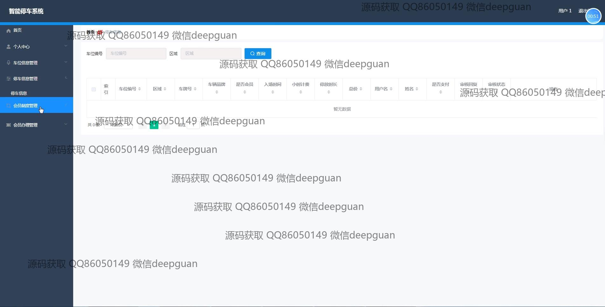
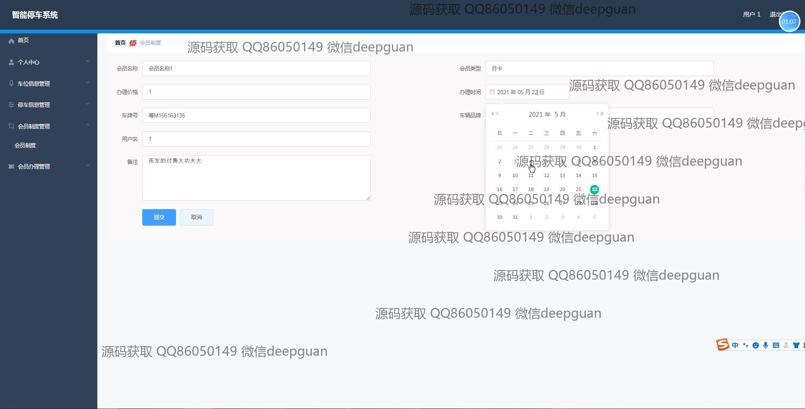
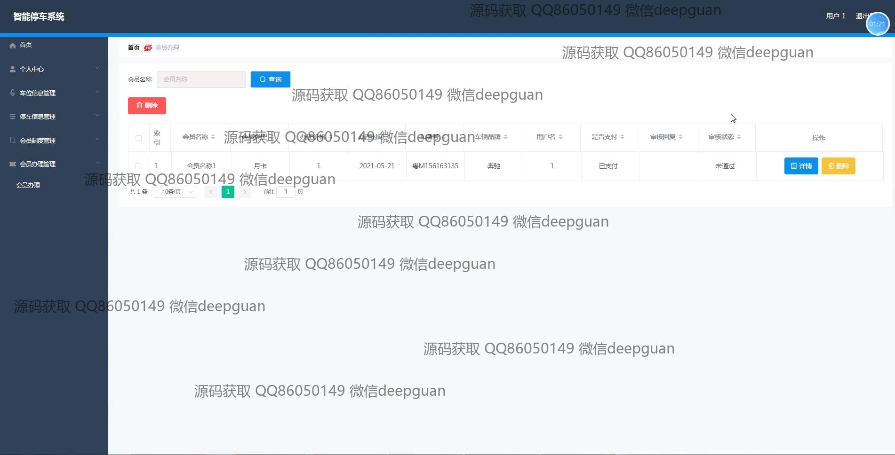
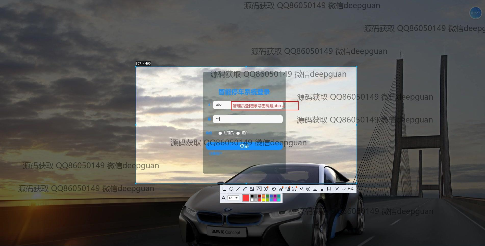
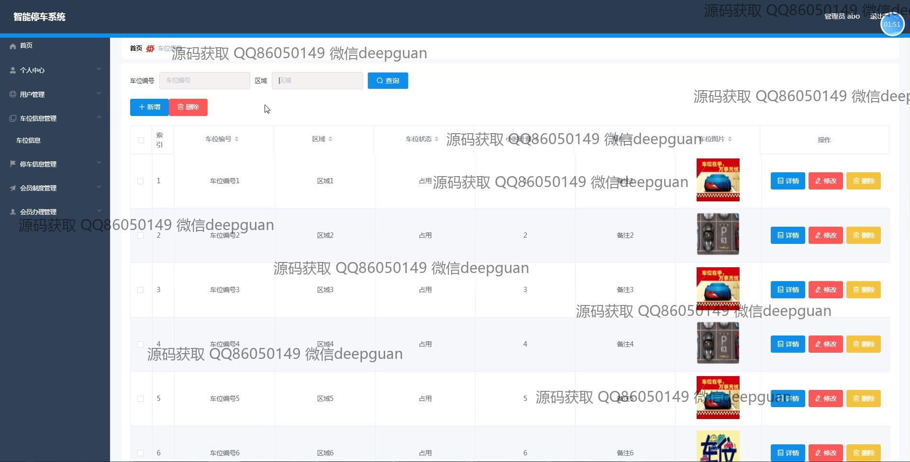
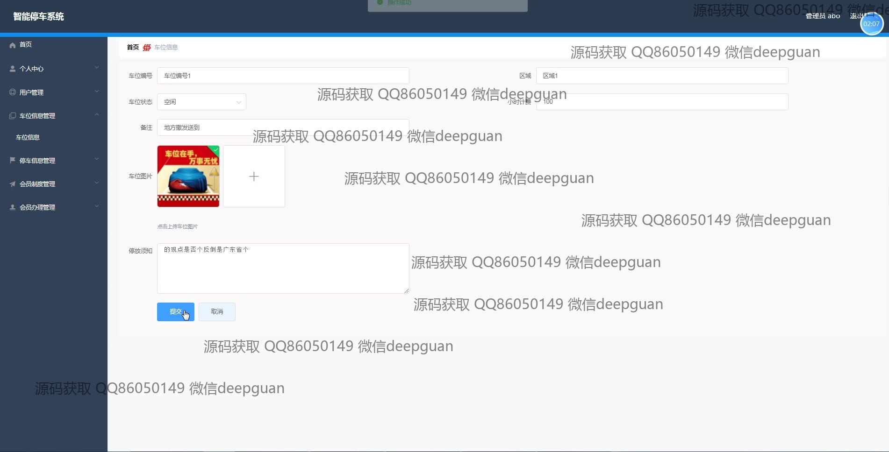
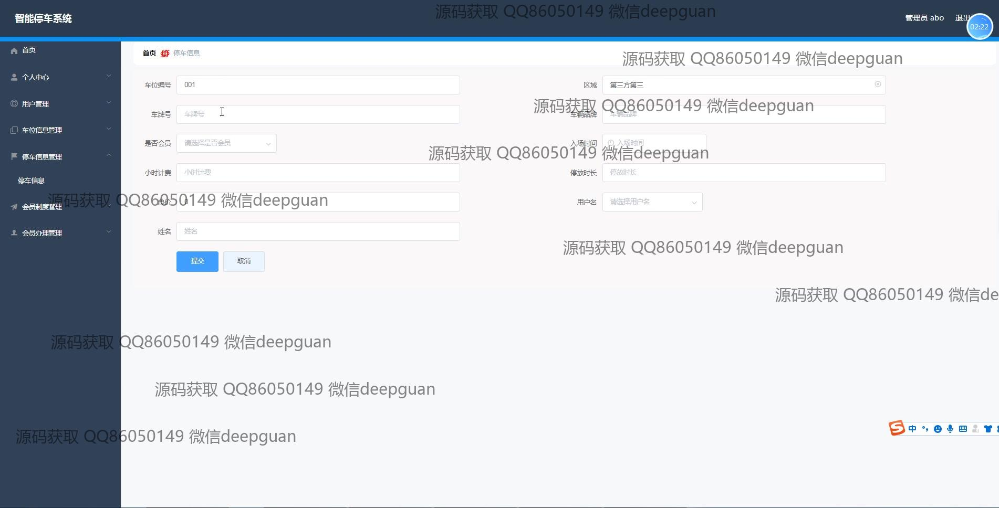
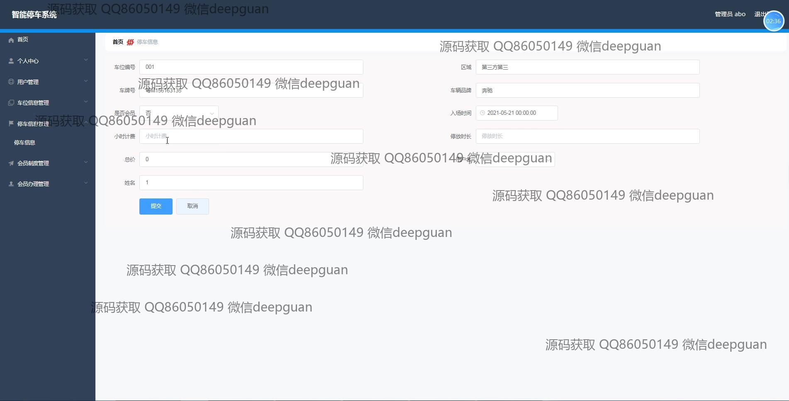
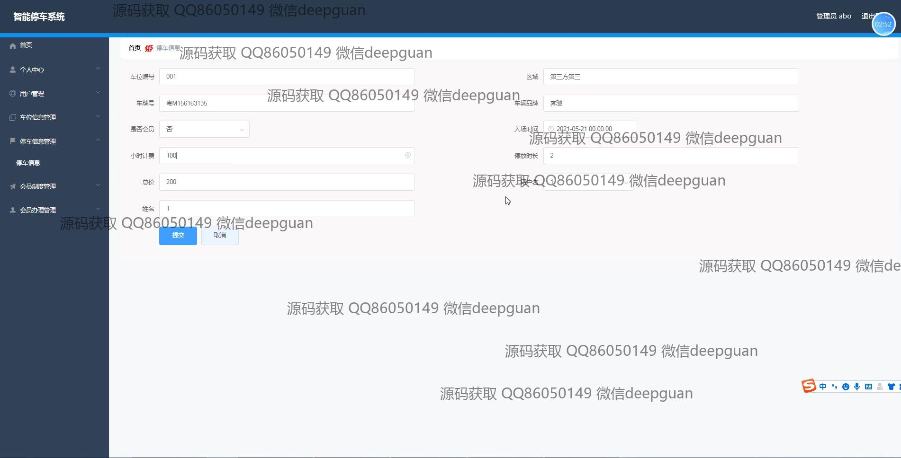
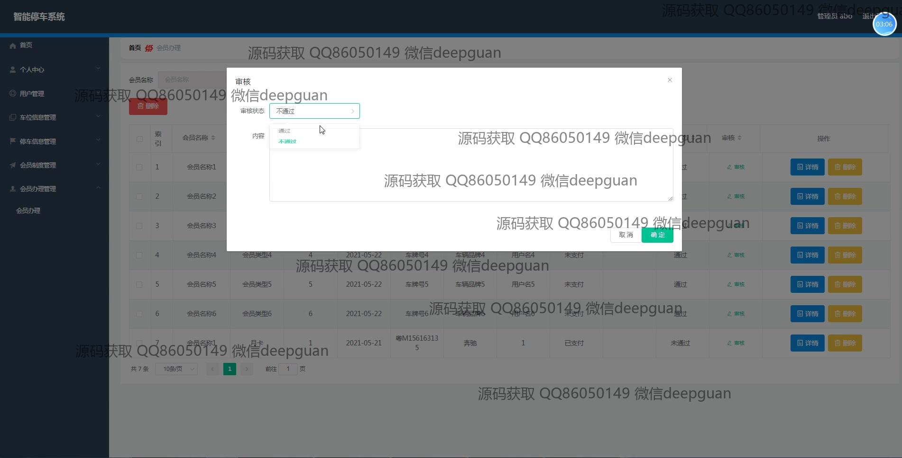
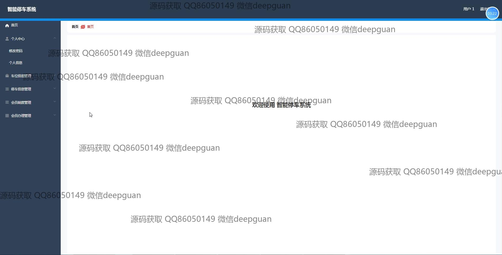
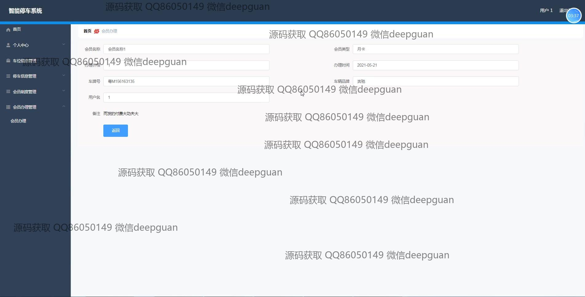
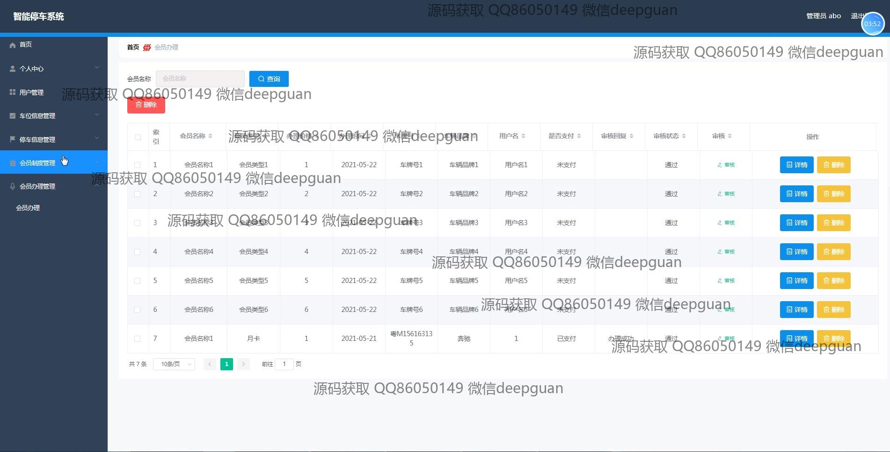

本代码来源于网络,仅供学习参考使用!

